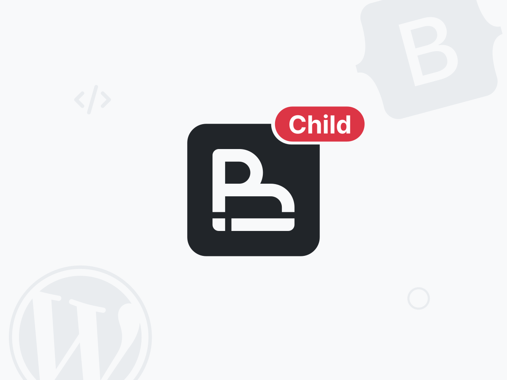

# Custom BootsCore Child Theme



## Overview

This is a **placeholder README** for the Custom BootsCore Child Theme. Replace this text with details about your theme, installation instructions, and usage notes.

## Features

- Built on top of [Bootscore](https://bootscore.me/)
- Custom styles and scripts
- Easy to extend and modify

## Installation

1. Download or clone this repository.
2. Copy the `bootscore-child` folder to your WordPress `wp-content/themes` directory.
3. Activate the theme in your WordPress admin panel.

## Usage

- Customize SCSS files in `bootscore-child/assets/scss/`.
- Add your own JavaScript in `bootscore-child/assets/js/custom.js`.
- Replace the logo in `bootscore-child/assets/img/logo/`.

## Development

To compile SCSS files, use your preferred build tool or task runner. Example (using npm scripts):

```bash
npm install
npm run build
```

## License

See `bootscore-child/LICENSE` for license information.

## Contributing

Pull requests are welcome! For major changes, please open an issue first to discuss what you would like to change.

## Credits

- [Bootscore](https://bootscore.me/)
- Placeholder content by [Your Name]
